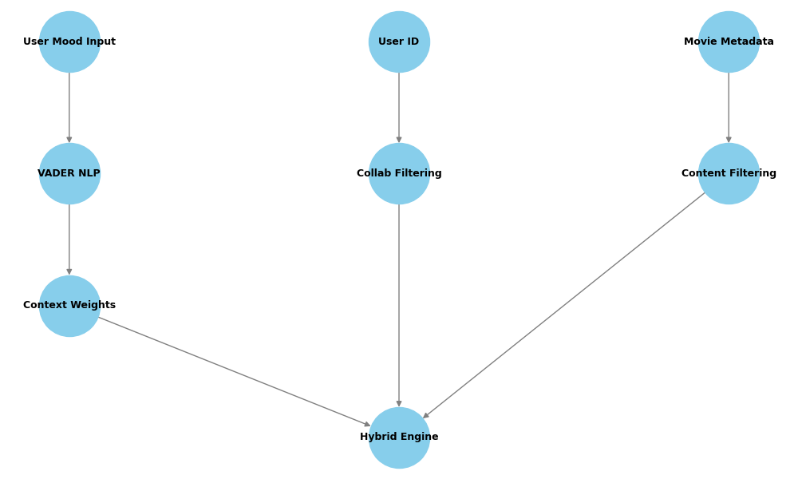
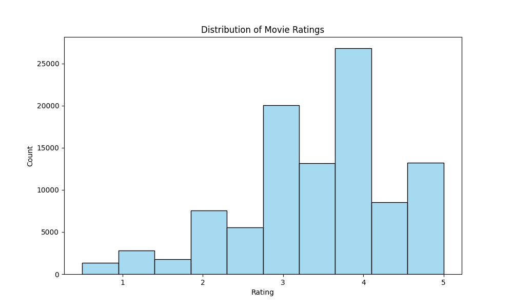
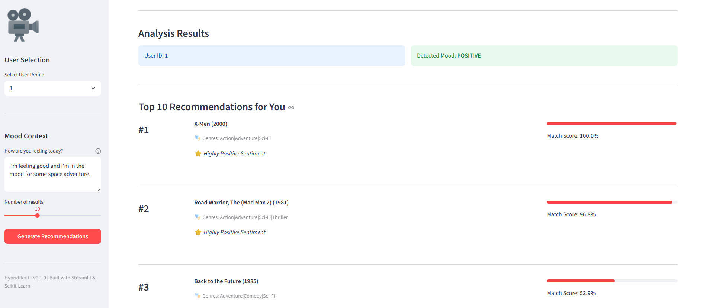
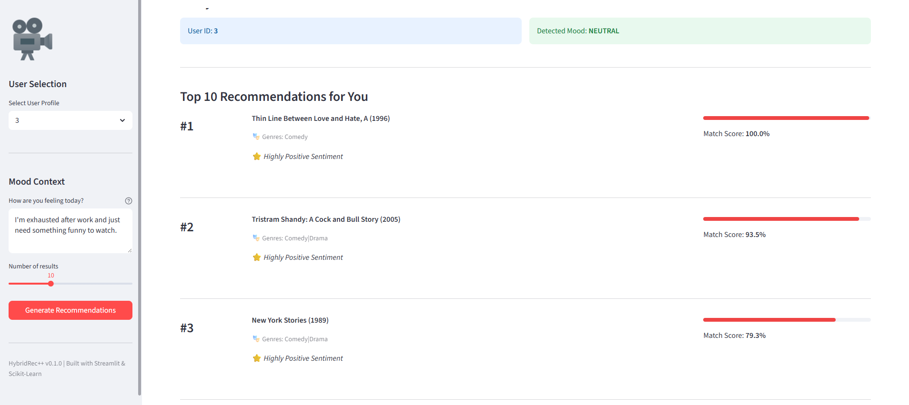
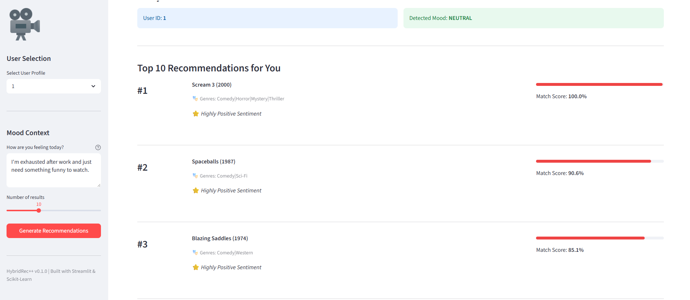
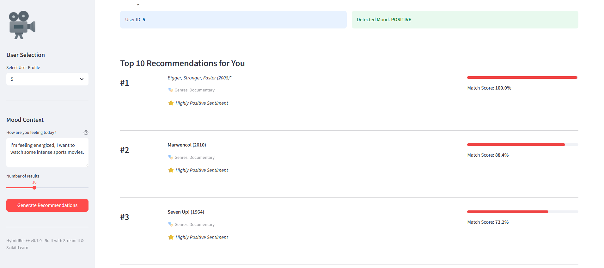
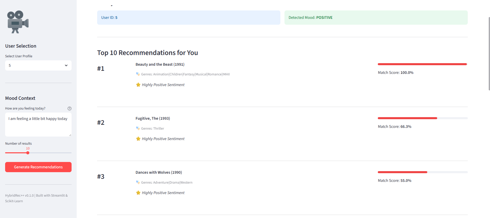
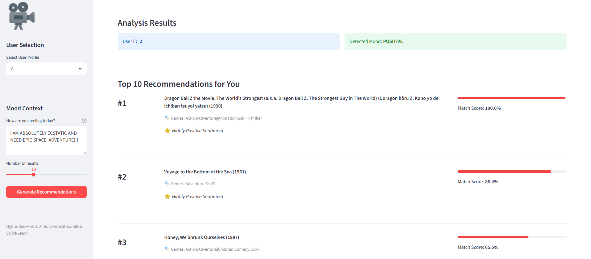

# HybridRec++ 🎬

**HybridRec++** is a production-grade recommendation system that bridges the gap between collaborative patterns and user sentiment. By integrating **Real-Time NLP** with **Matrix Factorization**, it delivers recommendations that adapt to the user's specific context.

## 🚀 Key Features

- **Hybrid Recommendation Engine**: Integrates SVD-based collaborative filtering with TF-IDF content-based similarity using a weighted fusion strategy to improve recommendation accuracy and handle cold-start problems.
- **True Personalization**: Recommendations are driven by your unique historical rating patterns, ensuring that the engine learns and adapts to your specific cinematic taste.
- **Mood-Aware Context**: Uses **VADER NLP** to analyze your sentiment in real-time, dynamically re-weighting the engine's output based on your current emotional state.
- **Intent-Driven Discovery**: Advanced keyword extraction instantly surfaces movies that match your specific thematic requests (e.g., 'sports', 'space', 'thriller').
- **Production-Ready Architecture**: Modular design, TDD-validated core, and cross-platform automated setup.
- **Visual Analytics**: Built-in architecture visualization and data distribution insights.

## 🛠️ Tech Stack
| Category | Technology |
| :--- | :--- |
| **Language** | Python 3.10+ |
| **Machine Learning** | Scikit-Learn (TruncatedSVD), Scikit-Surprise |
| **NLP** | NLTK, VADER Sentiment |
| **UI/Dashboard** | Streamlit |
| **Environment** | uv (High-speed package management) |
| **Automation** | Pytest, Git, GitHub Actions/CLI |

## 🏗️ Architecture

The HybridRec++ engine integrates three distinct recommendation layers with a real-time sentiment analysis context layer to balance historical preferences with real-time intent:



1.  **Collaborative Filtering Layer**: **The Personalization Core.** It uses Truncated SVD to map your unique history, ensuring your preferences are the primary driver of the results.
2.  **Content-Based Layer**: Ensures relevance by surfacing items that share characteristics (genres) with your favorites.
3.  **Sentiment/Context Layer**: Interprets your natural language "mood" and instantly re-balances the weight of your history vs. thematic discovery.
4.  **Hybrid Engine**: Synthesizes these inputs using our weighted dynamic-scoring algorithm, producing an optimized ranked list.

## 🛠️ Installation & Setup

This project uses `uv` for lightning-fast dependency management and environment execution.

### Prerequisites
- Python 3.10+
- `uv`

### Quick Start
1. **Initialize & Setup:**
   ```bash
   # Initializes virtual environment, installs dependencies, and downloads data
   uv run setup.py
   ```
2. **Launch Application:**
   ```bash
   uv run streamlit run app/streamlit_app.py
   ```
3. **Run Tests:**
   ```bash
   uv run pytest tests/test_collaborative.py
   ```
*(Using `uv run` ensures the application and tests always execute within the project's isolated, reproducible environment.)*


## 📊 Dataset Distribution
We analyzed the rating distribution from the MovieLens dataset to ensure the model is trained on a healthy range of data.




## 🧠 How the Hybrid Score Works
The engine uses a sophisticated three-factor scoring algorithm:

- **Base Score**: `0.5 * Collaborative (SVD) + 0.3 * Content (TF-IDF) + 0.2 * Item Sentiment`
- **Context-Aware Adjustment**: 
    - **Intensity**: We calculate mood intensity from -1.0 to 1.0. The stronger the emotion, the larger the dynamic boost to the recommendation score.
    - **Neutral Mode**: If no strong sentiment is detected, the engine gracefully falls back to the personalized collaborative filtering score, ensuring stable and reliable results.
    - **Positive/Negative Shift**: 
        - *Negative Sentiment*: Boosts feel-good items proportional to the user's negative intensity.
        - *Positive Sentiment*: Boosts historical collaborative matches proportional to the user's positive intensity.
    - **Topic Matching**: The system scans your input for semantic keywords (e.g., 'sports', 'funny', 'space') and applies an aggressive **0.8 boost** to corresponding movie genres, ensuring your specific intent is prioritized.

## 🧪 Testing the Context Engine
You can test the system's adaptability by trying these different mood scenarios:

| Mood Category | Input Example | Why it's interesting |
| :--- | :--- | :--- |
| **Relaxation** | *"I'm exhausted, need something funny."* | Boosts 'Comedy' genre + positive sentiment items. |
| **High Intensity** | *"I AM PUMPED! GIVE ME SPACE ACTION!"* | High-intensity boost for collaborative hits + Sci-Fi/Action genre boost. |
| **Baseline** | *"Just a normal day."* | Allows the Collaborative Engine to lead with pure history. |

### Visual Demonstrations
The system's hybrid logic dynamically calculates relevance by orchestrating **Sentiment Intensity** with **Intent-Based Topic Extraction**. The following visual gallery illustrates the engine's real-time adaptability, showing how it transforms raw user feedback into distinct, highly personalized recommendation rankings across diverse moods, contexts, and user profiles.

   
  

---